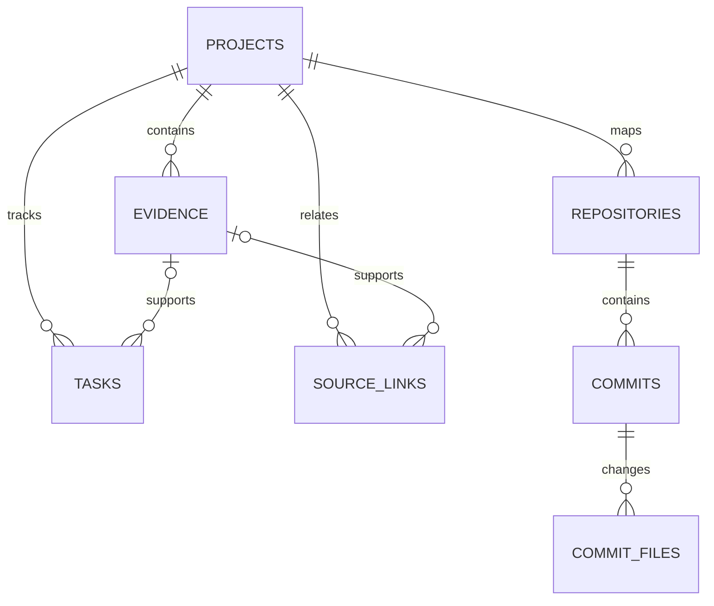

# Local evidence schema

`projects` supplies the stable customer/project boundary. `evidence` is the primary work-history timeline: it records sourced requests, decisions, implementations, verification, delivery, cancellation, and replacement, and is mirrored into an FTS5 index. `tasks` is optional and holds only explicitly assigned or unresolved work while its source evidence preserves why that state changed. `repositories`, `commits`, and `commit_files` contain metadata only; Git remains authoritative for code and blobs. `source_links` connects Slack messages, tasks, documents, repositories, commits, browser observations, and other source identities with an explicit confidence label.

Developer workflows add `project_documents`, `work_items`, `work_item_dependencies`, `work_item_events`, `work_item_estimates`, `work_item_acceptance_criteria`, and `architecture_snapshots`. Work items keep their current state while events preserve the append-only transition history. Source and engineering estimates use separate versioned keys. Acceptance criteria retain their explicit/proposed origin and approval state. Architecture snapshots store Mermaid source, detailed Markdown, evidence references, verification status, and capture time.

Verification levels describe what was inspected: `slack`, `official-docs`, `admin`, `code`, `execution`, or `production`. Relationship confidence is `explicit`, `verified`, `inferred`, or `unresolved`.
