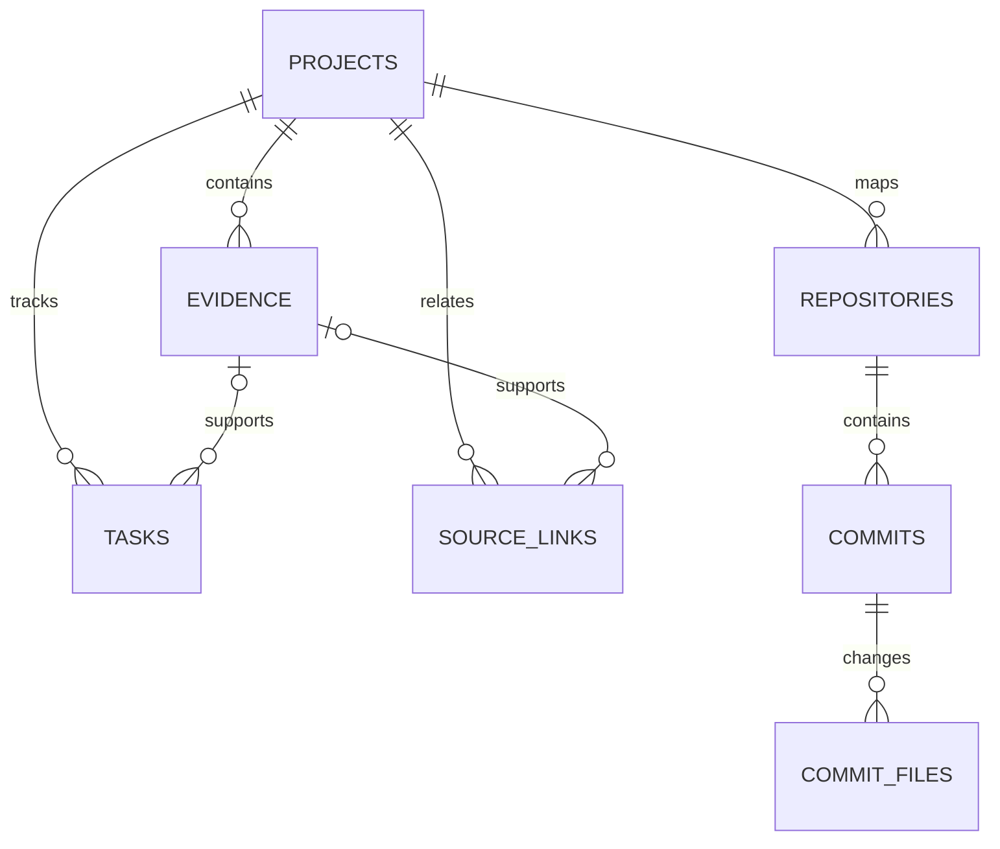

# Local evidence schema

`projects` supplies the stable customer/project boundary. `evidence` records sourced claims and is mirrored into an FTS5 index. `tasks` holds the current TODO state while its source evidence preserves why that state changed. `repositories`, `commits`, and `commit_files` contain metadata only; Git remains authoritative for code and blobs. `source_links` connects Slack messages, tasks, documents, repositories, commits, browser observations, and other source identities with an explicit confidence label.

Verification levels describe what was inspected: `slack`, `official-docs`, `admin`, `code`, `execution`, or `production`. Relationship confidence is `explicit`, `verified`, `inferred`, or `unresolved`.

